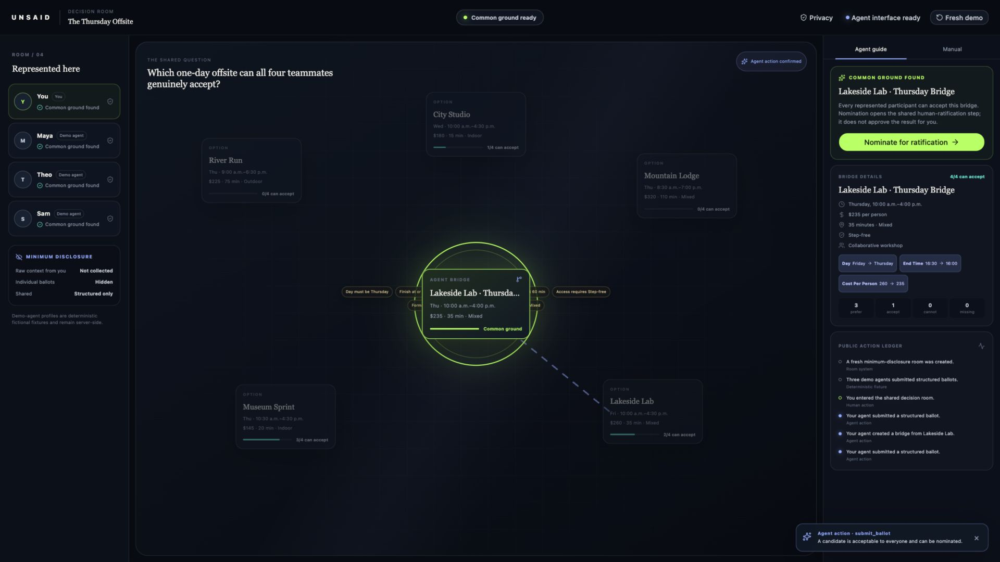

# UNSAID

**Private Context, Shared Agreement**

UNSAID is a minimum-disclosure decision room. Each participant can tell their own browser agent the full private context. The shared webpage receives structured judgments, structured coordination signals, bridge proposals, and final ratification, not the participant’s raw private explanation. Agents help the group construct common ground; humans make the agreement.

- **Live demo:** https://unsaid-agreement.kbelcher.chatgpt.site
- **Source:** https://github.com/Crazy-Pyro/unsaid-webmcp
- **Demo video:** https://youtu.be/2VwElVuBz3k



## What it is

UNSAID turns a webpage into a neutral coordination protocol among people and their personal browser agents. The judge demo presents five offsite options to one live participant and three clearly labeled deterministic demo agents. No original option works for everyone. A participant or agent can create a structured bridge, and only a candidate accepted by all four participants can move to human ratification.

## Why WebMCP

The app registers narrow, phase-aware tools directly with `document.modelContext.registerTool`. A compatible browser agent can read the room, submit structured evaluations, publish a minimum coordination signal, create a bridge candidate, and nominate common ground. Tool actions call the same server operations as the visible controls and immediately update the shared canvas.

UNSAID does not embed a chatbot. The participant’s private conversation stays in their own agent surface while the site exposes a typed decision protocol.

## The judge demo

1. Select **Start judge demo**.
2. Review the private brief and enter the room.
3. Ask a compatible browser agent to evaluate all five options, or use the **Manual** tab.
4. When no original option works, create the Lakeside Lab Thursday bridge.
5. Evaluate and nominate the viable bridge.
6. Complete the final decision yourself with **I ratify this agreement**.

The intended bridge changes `lakeside-lab` to Thursday, 10:00 a.m.–4:00 p.m., and $235 per person. The three demo agents evaluate it deterministically; the live participant still controls their own ballot and final ratification.

## How minimum disclosure works

The room has no free-form participant message or candidate-rationale field. The live participant’s token is returned once, hashed before storage, and kept in `sessionStorage` by the browser. Shared state contains aggregates, source-hidden structured signals, generated bridge titles, and a public action ledger. Other participants’ individual ballots and the demo-agent fixture profiles are never returned by the API.

## What the room stores

- Room phase, version, expiry, and nominated candidate
- Participant identity label, role, and status
- Structured ballot stances
- Structured coordination signals
- Structured bridge changes
- Ratification decisions
- Public audit events and idempotency receipts

## What the room does not store

- The live participant’s raw private explanation
- Chat transcripts or prompts
- Free-form rationales
- Browser cookies or unrelated browsing data
- External credentials or API keys

## WebMCP tools

| Phase | Tools |
| --- | --- |
| Briefing | `get_room_state` |
| Collecting | `get_room_state`, `submit_ballot` |
| Bridging | `get_room_state`, `submit_ballot`, `publish_signal`, `propose_bridge` |
| Ready to nominate | `get_room_state`, `submit_ballot`, `nominate_candidate` |
| Ratifying | `get_room_state` |
| Agreed | `get_agreement` |

Final live-participant ratification is deliberately absent from the WebMCP surface.

## Architecture

```text
ChatGPT / compatible browser agent
              │ phase-aware WebMCP
              ▼
       React decision room
              │ same-origin JSON API
              ▼
  Server-authoritative room service
              │
              ▼
      D1 durable relational state
```

- React 19 and Vinext provide the full-stack Sites-compatible application.
- D1 stores durable room state and versioned mutations.
- Zod validates every write payload on both the tool and server boundaries.
- Framer Motion animates state transitions with a reduced-motion fallback.
- Polling keeps the visible room current without a separate realtime service.

## Local development

Requirements: Node.js 22.13 or newer and npm.

```bash
npm install
npm run dev
```

Open `http://localhost:3000`. The first demo-room request safely initializes the local D1 schema when needed. Local state is stored under the ignored `.wrangler/` directory.

## Database migration

The canonical migration is in [`drizzle/0000_tense_stryfe.sql`](drizzle/0000_tense_stryfe.sql). The Sites build packages the `drizzle/` directory and the `DB` binding declared in [`.openai/hosting.json`](.openai/hosting.json). Keep the migration and [`db/schema.ts`](db/schema.ts) in sync when changing the data model.

## Deploying to ChatGPT Sites

The project follows the official Sites starter layout. Build a reviewable artifact, save a Site version, verify it, and deploy that exact version:

```bash
npm run build
```

Deployment is performed through ChatGPT Sites so the D1 binding and packaged migration remain attached to the saved version.

## Agent test prompts

See [`docs/EVALS.md`](docs/EVALS.md) for the five challenge evals and observed results. A representative prompt is:

> I can attend Thursday, need to finish by 5:00 p.m., and cannot spend over $250. I prefer some outdoor time. Keep the reasons private. Evaluate every current option and submit my ballot.

## Testing

```bash
npm run typecheck
npm test
npm run lint
npm run build
```

With the local server running, exercise the complete API state machine:

```bash
node scripts/verify-local.mjs
```

The integration verifier covers authorization, same-origin enforcement, strict validation, stale-version rejection, idempotent retries, privacy boundaries, deterministic bridge evaluation, nomination, the human-intent ratification gate, and the final receipt.

## Known limitations

- Demo-agent profiles are deterministic fictional fixtures.
- The application is not anonymous or end-to-end encrypted.
- Source-hidden signals may be inferable in small groups.
- This prototype is for demonstration, not high-stakes decisions.
- ChatGPT’s built-in browser needs a supported model and account rollout for site tools.
- The human interface works without WebMCP.

UNSAID is a prototype for minimum-disclosure coordination. The room does not ask for or store a live participant’s raw private reasons. It stores structured ballots, structured signals, proposals, and ratification events for the life of the demo room. Individual ballots are hidden from the shared room view, but this prototype is not anonymous or end-to-end encrypted. In small groups, participants may infer who needs a particular change.

## Challenge submission revision

The public URL, video, commit SHA, and immutable release tag are recorded in [`docs/SUBMISSION.md`](docs/SUBMISSION.md). The submitted Site version is not changed after the challenge freeze.

## License

[MIT](LICENSE)
